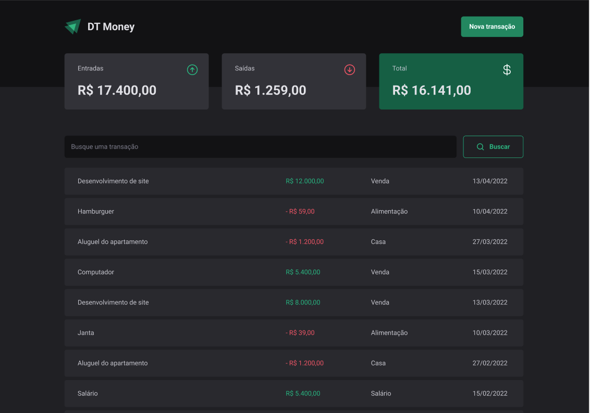

# DT Money

Creating a project for financial control using React with Typescript, styled components and radix-ui

First, install the dependencies:

```bash
npm install
```
Second, run the application development:

```bash
npm run dev
```

Third, run the server
```bash
npm run dev:server
```

| :placard: About the project  |     |
| -------------  | --- |
| :sparkles: Nome        | **DT Money**
| :label: Tecnologias | Vite, React, Typescript, Styled Components, Eslint, Radix-UI
| :rocket: URL         | https://www.figma.com/file/vDhzWjOVdWXtqHCTGt7bR3/DT-Money-(Community)?type=design&node-id=42078-424&mode=design&t=jWLK65rg18mHnCXJ-0



